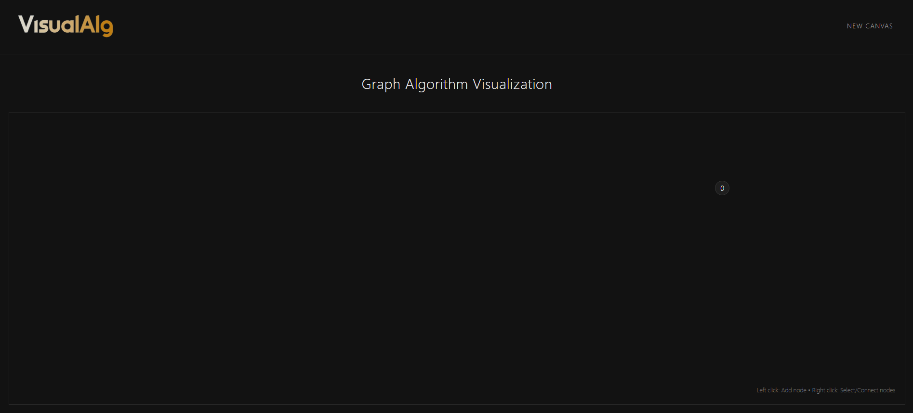

# Visual Algorithm: Interactive Graph Algorithm Visualization Tool

[](https://opensource.org/licenses/MIT)


An interactive web application for visualizing graph algorithms like BFS (Breadth-First Search) and DFS (Depth-First Search). Create nodes, connect them, and watch algorithms traverse the graph with animated visualizations.

## 🚀 Live Demo

[Check out the live demo](https://graphsense.netlify.app/)



## ✨ Features

- **Interactive Graph Creation**: Create nodes with left clicks and connect them with right clicks
- **BFS Algorithm Visualization**: Watch how the Breadth-First Search algorithm traverses the graph
- **DFS Algorithm Visualization**: See the Depth-First Search algorithm in action
- **Real-time Animation**: Clearly visualized node traversal with color coding
- **Clean, Minimal UI**: Dark mode interface designed for clarity and focus
- **Responsive Design**: Works on various screen sizes and devices

## 🛠️ Technologies Used

- **React**: UI components and state management
- **Development Environment**: Fast development and build tooling
- **Tailwind CSS**: Utility-first styling framework
- **CSS Transitions**: Smooth animations for algorithm visualization

## 🚀 Getting Started

### Prerequisites

- Node.js (v14 or higher)
- Package manager (npm or yarn)

### Installation

1. Clone the repository

```bash
git clone https://github.com/abhisheksharm-3/algo-visualizer.git
cd algo-visualizer
```

2. Install dependencies

```bash
npm install
# or
yarn
```

3. Start the development server

```bash
npm run dev
# or
yarn dev
```

4. Open your browser and navigate to `http://localhost:5173`

## 📖 How to Use

1. **Create Nodes**: Left-click anywhere on the canvas to create nodes
2. **Select a Start Node**: Right-click on a node to select it as the starting point (highlighted in red)
3. **Connect Nodes**: Right-click on another node while having a start node selected to create a connection
4. **Run Algorithms**: 
   - Click the "Start BFS" button to visualize the Breadth-First Search algorithm
   - Click the "Start DFS" button to visualize the Depth-First Search algorithm
5. **Create a New Canvas**: Click "New Canvas" in the navigation bar to reset and start over

## 📁 Project Structure

```text
visual-alg/
├─ public/
│  ├─ logo.png
│  └─ assets.svg
├─ src/
│  ├─ assets/
│  │  ├─ Desktop Design.jpeg
│  │  └─ Mobile Design.jpeg
│  ├─ components/
│  │  ├─ Graph.jsx            # Graph rendering component
│  │  ├─ graphAlgorithms.jsx  # BFS and DFS algorithm implementations
│  │  ├─ Navbar.jsx           # Navigation bar component
│  │  └─ Visualization.jsx    # Main visualization controller
│  ├─ App.jsx                 # Root application component
│  ├─ Home.jsx                # Home page layout
│  ├─ index.css               # Global styles
│  └─ main.jsx                # Entry point
├─ index.html
├─ package.json
├─ postcss.config.js
├─ tailwind.config.js
└─ vite.config.js
```

## 🧠 How It Works

### Graph Representation

- Nodes are stored as objects with x, y coordinates and labels
- Edges are represented as source-target pairs

### BFS Algorithm

1. Starts with selected node(s)
2. Explores all neighbors at the current depth level
3. Moves to the next depth level
4. Visualizes the traversal with a 700ms delay between node visits

### DFS Algorithm

1. Starts with selected node(s)
2. Explores as far as possible along each branch before backtracking
3. Uses a stack to keep track of nodes to visit
4. Visualizes the traversal with a 700ms delay between node visits

## 🤝 Contributing

Contributions are welcome! Here's how you can help:

1. Fork the repository
2. Create a feature branch (`git checkout -b feature/amazing-feature`)
3. Commit your changes (`git commit -m 'Add some amazing feature'`)
4. Push to the branch (`git push origin feature/amazing-feature`)
5. Open a Pull Request

---

Built with ❤️ by [Abhishek Sharma](https://github.com/abhisheksharm-3)